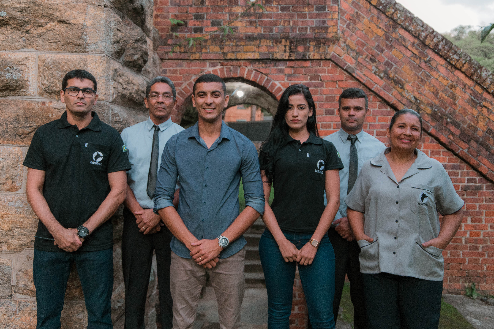

# 🌐 Grupo Sentinel — Website Institucional  



> Website moderno e responsivo para apresentação institucional do **Grupo Sentinel**, uma empresa especializada em **Limpeza Técnica, Portaria, Vigilância Patrimonial, Segurança Eletrônica e Roçagem/Conservação**.  

---

## 🚀 Tecnologias Utilizadas  
Este projeto foi desenvolvido utilizando as seguintes tecnologias:

- **HTML5** — Estrutura semântica do site  
- **CSS3** — Estilização responsiva e moderna  
- **JavaScript (Vanilla)** — Interatividade (menu drawer e slider automático)  
- **Google Fonts (Inter)** — Tipografia limpa e profissional  

---

## 📑 Estrutura do Projeto  

- **Header fixo** → Contém logo, botão de menu e navegação lateral (drawer).  
- **Slider responsivo** → Exibe imagens com transição automática e botões de navegação.  
- **Sessão de Serviços** → Cards com detalhes de cada solução oferecida.  
- **CTA (Call to Action)** → Destaque para contato rápido via WhatsApp.  
- **Rodapé completo** → Contatos, redes sociais, endereço e direitos autorais.  
- **Botão flutuante do WhatsApp** → Facilita o atendimento virtual imediato.  

---

## 🖼️ Páginas e Componentes  

- `index.html` → Página inicial com apresentação dos serviços.  
- **Cards de Serviços**:  
  - Limpeza Técnica (painéis solares e ambientes)  
  - Vigilância Patrimonial  
  - Roçagem e Conservação  
- **Drawer (Menu lateral)** com links para:  
  - Home  
  - Zeladoria  
  - Portaria 24h  
  - Limpeza & Conservação  
  - Vigilância  
  - Segurança Eletrônica  
  - Contato  

---

## 🎨 Destaques Visuais  

- **Tema escuro elegante** com cores de destaque em **roxos e verdes vibrantes**.  
- **Layout responsivo**: adapta-se a celulares, tablets e desktops.  
- **Elementos modernos**: cards arredondados, gradientes e botões interativos.  
- **Imagens otimizadas** para exibir os serviços com clareza.  

---

## 📲 Demonstração  

🔗 Acesse o site publicado em:  
[👉 Clique aqui para ver o projeto](https://desenvolvedorawellington.github.io/SENTINEL-facilite/)  

---

## 📞 Contato  

**Grupo Sentinel**  
- 📍 Brasília / DF — Atuação em **DF, GO, RJ e MG**  
- 📩 comercial@gruposentinel.com.br  
- 📞 (61) 99668-1574  

Redes Sociais:  
[Instagram](#) • [Facebook](#) • [WhatsApp](#)  

---

## ⚡ Como Rodar Localmente  

1. Clone este repositório:  
   ```bash
   git clone https://github.com/SEU-USUARIO/SEU-REPOSITORIO.git
